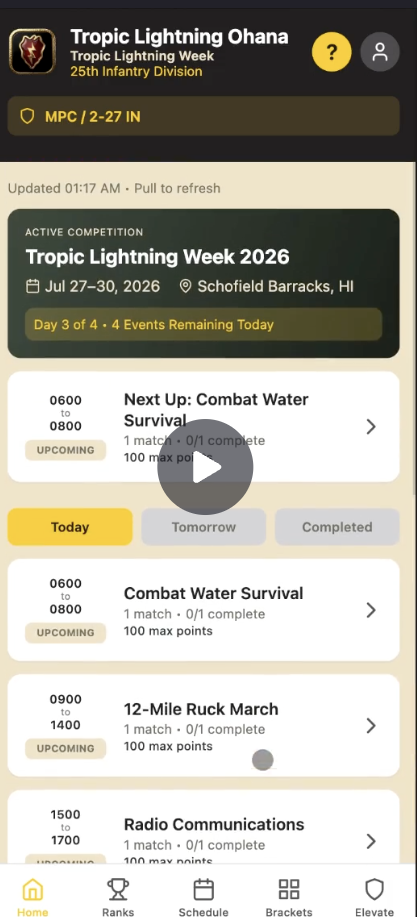
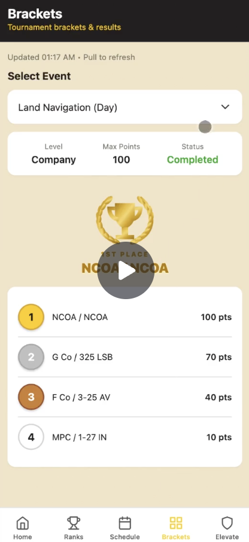

  
  

During my summer internship, I worked as a developer on a mobile application for the 25th Infantry Division's Tropic Lightning Week. The purpose of the app was to provide one place for soldiers and event organizers to view competition schedules, track scores, and see unit rankings throughout the event. The application also included administrative features that allowed authorized users to manage competitions, update scores, and organize event information.

The application was developed using React Native and Expo, allowing it to run across iOS, Android, and the web. I worked primarily on the front end, developing and improving features such as competition search, schedule navigation, completed-event viewing, score entry, and other user interface components. The app communicated with a backend to store and retrieve competition information while also supporting features such as user authentication and role-based access. Throughout development, our team used Git and GitHub to manage different branches, combine our work, test changes, and collaborate on the same codebase.

This project gave me experience working on a larger software project as part of a development team. I became more comfortable with React Native, JavaScript, Git, GitHub, APIs, debugging, and testing an application across different platforms and devices. I also learned how important communication and collaboration are when multiple developers are working on interconnected features. Most importantly, the experience showed me how software development can be used to create a practical solution for a real organization and its users.
